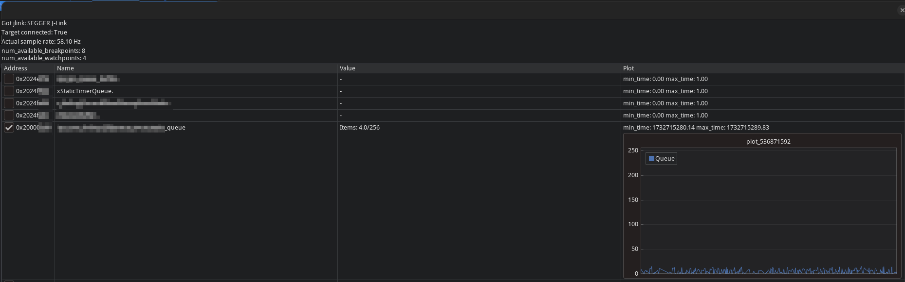

# queuetracer




Proof-of-concept for a Python script that can sample FreeRTOS queues and plot their depth over time.

It finds locations of StaticQueue_t structures in the firmware binary and uses a SEGGER J-Link to sample the queues at runtime.

## Usage

1. Install the required Python packages:

```bash
poetry install
```

2. Run the script:

```bash
poetry run queuetracer <path-to-firmware-elf>
```

The ELF must match what is running on the target device and must contain debug information. Note that for large binaries the script might take a moment start up and analyze the binary.
